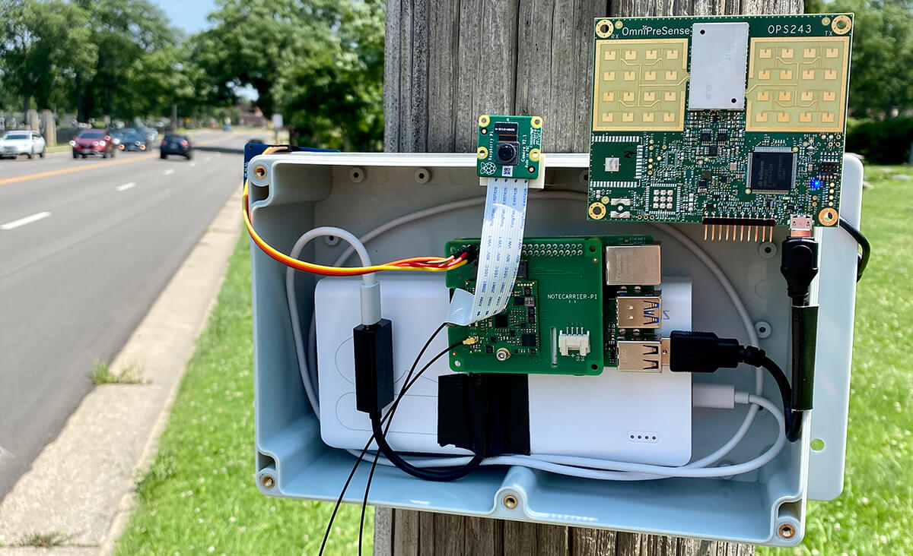
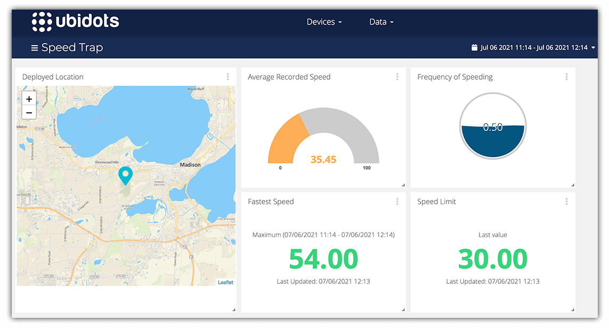

# Busted! Create an ML-Powered Speed Trap

In this project, I built a portable speed trap that can be used to monitor
traffic speed conditions in your neighborhood. By using an ML model to identify
vehicles, a doppler radar sensor to detect speed, and a
[cellular module](https://blues.io/) to relay collected data to the cloud, it
was surprisingly easy to build out this IoT solution!

> Watch an [intro video](NEED LINK) and then view the complete tutorial over at
> [Hackster.io](NEED LINK)!

_Field deployment._

_Ubidots dashboard._

**Hardware:**

- [Raspberry Pi 4](https://www.raspberrypi.org/products/raspberry-pi-4-model-b/)
- [Notecard and Notecarrier-PI HAT](https://blues.io/products/) from Blues
  Wireless
- [PiCamera v2](https://www.raspberrypi.org/products/camera-module-v2/)
- [OPS243-A Doppler Radar Sensor](https://omnipresense.com/product/ops243-doppler-radar-sensor/)
- [Adafruit Seven-segment Display](https://www.adafruit.com/product/879)
- [30000mAh Power Bank](https://smile.amazon.com/gp/product/B07H5T9J4L/ref=ppx_yo_dt_b_asin_title_o02_s02?ie=UTF8&psc=1)
- [Enclosure](https://smile.amazon.com/gp/product/B07NSTRJN7/ref=ppx_yo_dt_b_asin_title_o02_s02?ie=UTF8&psc=1)

**Software and Services:**

- [Python](https://www.python.org/)
- [Notehub.io](https://blues.io/services/)
- [Edge Impulse](https://www.edgeimpulse.com/)
- [Ubidots](https://ubidots.com/)
